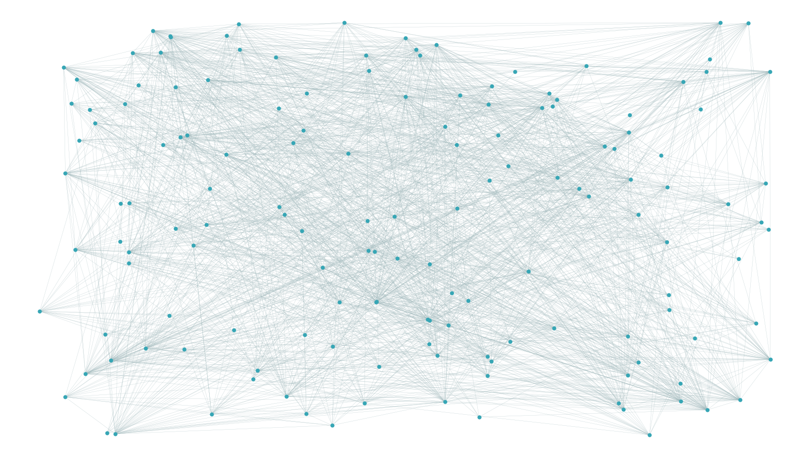

# Link prediction project
Repository for scientific project in Petnica Science Center

## Abstract

This paper explores what data is best to train a classifier that predicts friendships in social networks. The accuracies of the classifiers that were trained by user data (node attributes) and similarity metrics (network topology)were compared. Similarity metrics were better for smaller network, because classifiers trained by similarity metrics gave an average accuracy of 75.65% and classifiers trained by node attributes accuracy of 60.87%. For larger social network, the situation is reversed, as classifiers trained by similarity metrics give an average accuracy of 81.46%, and classifiers trained by node attributes accuracy of 87.17%. From this, we can conclude that it is better to use information about users than similarity metrics to train classifiers for large social networks. Node attributes and similarity metrics were also analyzed to see which attributes and which metrics are the best in prediction. Attributes that are related to user education and job are the best for predicting friendships. As for the similarity metrics, *Resource Allocation* metric is the most important metric in predictions that use similarity metrics.
